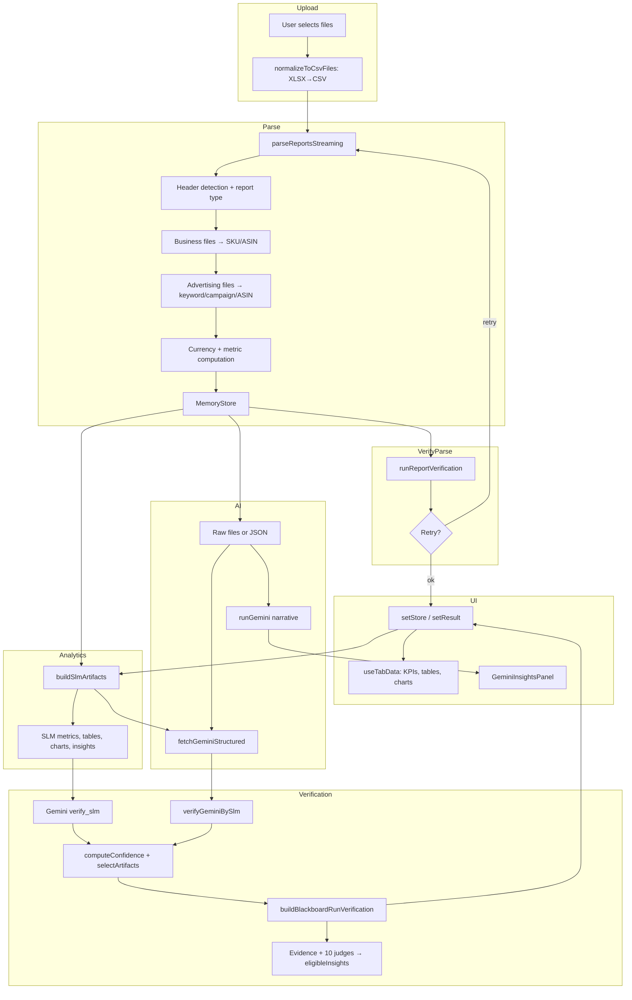

# Amazon Advertising Audit Platform — Architecture Audit

**Document type:** Actual implemented architecture (as discovered from codebase).  
**Last audit:** Generated from repository analysis.

---

## 1. System Overview

### End-to-end pipeline

```
┌─────────────────┐     ┌──────────────────┐     ┌─────────────────┐     ┌────────────────────┐     ┌──────────────────┐     ┌────────────────┐
│ Report Upload   │────▶│ File Normalization│────▶│ Data Parsing    │────▶│ Analytics (SLM)     │────▶│ AI Engines       │────▶│ Verification   │
│ (UploadPanel)   │     │ (XLSX→CSV)        │     │ (reportParser)  │     │ (slmPipeline +     │     │ (Gemini API +    │     │ (dual-engine   │
│                 │     │                   │     │                  │     │  diagnostics)       │     │  narrative API)   │     │  + Blackboard  │
└─────────────────┘     └──────────────────┘     └────────┬────────┘     └─────────┬──────────┘     └────────┬─────────┘     │  Verification  │
                                                            │                        │                         │               │  Guild)         │
                                                            │                        │                         │               └────────┬───────┘
                                                            ▼                        ▼                         ▼                        │
                                                     ┌──────────────┐         ┌──────────────┐         ┌──────────────┐               │
                                                     │ MemoryStore   │         │ SLM artifacts│         │ Gemini       │               │
                                                     │ (in-memory)   │         │ (metrics,    │         │ (structured  │               ▼
                                                     │               │         │  tables,     │         │  + narrative)│         ┌──────────────┐
                                                     │               │         │  charts,     │         │              │         │ Consensus +   │
                                                     │               │         │  insights)   │         │              │         │ eligible      │
                                                     └───────┬───────┘         └──────┬───────┘         └──────┬───────┘         │ insights      │
                                                             │                        │                         │               └──────┬───────┘
                                                             │                        └────────────┬────────────┘                      │
                                                             │                                     │                                    │
                                                             ▼                                     ▼                                    ▼
                                                     ┌──────────────────────────────────────────────────────────────────────────────────────┐
                                                     │ UI rendering: AuditStoreContext (store) + useTabData (KPIs, patterns, tables, charts)     │
                                                     │ + GeminiInsightsPanel (narrative) + dualEngine result (confidence; validated.insights     │
                                                     │   used when Evidence Guild passes; most tabs derive from store, not validated)            │
                                                     └──────────────────────────────────────────────────────────────────────────────────────┘
```

### High-level flow (Mermaid)



### Flow summary

1. **Upload** — User selects files in `UploadPanel`; `handleUploadComplete` in `page.tsx` receives `File[]`.
2. **Normalization** — `normalizeToCsvFiles(files)` converts `.xlsx`/`.xls` to CSV via `xlsx`; CSV files pass through. **File refs:** `src/app/audit/utils/xlsxToCsv.ts`.
3. **Parsing** — `parseReportsStreaming(csvFiles, ...)` runs: header detection → report type classification → business files first (SKU→ASIN), then advertising files (campaign then others). Dedupe by composite key; aggregate into `MemoryStore`. Currency detected from sample; then metric computation (ACOS, ROAS per keyword/campaign/ASIN; store metrics). **File refs:** `src/app/audit/utils/reportParser.ts`.
4. **Post-parse verification** — `runReportVerification(store)` (cross-report, data integrity, ACOS/ROAS verification). Up to `MAX_PARSING_RETRIES` (3) if confidence &lt; 80%. **File refs:** `src/app/audit/utils/reportVerification.ts`.
5. **Store & learning** — `setStore(store)`; `runLearning(store)` (cross-account learning). **File refs:** `src/app/audit/context/AuditStoreContext.tsx`, `src/app/audit/learning/LearningContext.tsx`.
6. **Analytics** — SLM runs immediately: `buildSlmArtifacts(store)` (metrics, tables, charts, insights from diagnostics + sanity). **File refs:** `src/app/audit/dualEngine/slmPipeline.ts`, `src/app/audit/engines/diagnosticEngines.ts`, `src/app/audit/utils/sanityChecks.ts`.
7. **AI engines** — With `deferGemini: true`: SLM result shown first; then in background: `fetchGeminiStructured(store, rawFiles)` (dual-engine API) and `runGemini(store, { rawFiles })` (generate-insights for narrative). Gemini can receive **raw files** (multipart) or JSON payload only.
8. **Verification** — Gemini verifies SLM via `/api/dual-engine` mode `verify_slm`; SLM verifies Gemini via `verifyGeminiBySlm`. Confidence = average of both. Then `buildBlackboardRunVerification(store, slmArtifacts, geminiArtifacts)` runs Blackboard pipeline (ingestion layer optional, Math Auditor, Traffic & Intent, Verification Guild with Evidence Engine). If verification score ≥ 0.9 and there are eligible insights, `validated.insights` is replaced with `blackboard.eligibleInsights`. **File refs:** `src/app/audit/dualEngine/confidenceEngine.ts`, `src/app/audit/blackboard/pipeline.ts`, `src/app/audit/verification/consensusEngine.ts`.
9. **UI** — Tabs read from `useTabData(tabId)` which uses **store** (and diagnostics/sanity) for KPIs, patterns, opportunities, tables, chartIds, insightModules. Gemini narrative comes from `GeminiReportContext` (generate-insights). Dual-engine result holds `validated` and confidence but most tab content is **store-derived**; `validated.insights` (Evidence-eligible) are available on the dual-engine result for consumers that choose to use them.

---

## 2. Data Ingestion Architecture

### How files are parsed

- **Entry:** `parseReportsStreaming(files, onProgress?, onStageUpdate?)` in `src/app/audit/utils/reportParser.ts`.
- **Libraries:** PapaParse (streaming, `header: true`, `chunkSize: PARSER_CHUNK_SIZE` = 10,000), no web worker.
- **Order:** For each file, `getHeaderMapFromFile(file)` gets first row → `mapHeaders(fields)` + `classifyReportType(headerMap)` → files grouped into business / advertising / unknown. Business files parsed first to build SKU→ASIN map; then campaign-type advertising (contribute to totals), then other advertising (optionally contribute). Unknown files classified by presence of spend/sales.
- **Per row:** Raw values read via `headerMap` canonical keys; numerics via `sanitizeNumeric(row[rawKey])`; dates via `normalizeDate`; composite key for dedupe; then accumulation into `store.keywordMetrics`, `store.asinMetrics`, `store.campaignMetrics`, and store-level totals.

### Supported files

- **Formats:** CSV; XLSX/XLS (converted to CSV in memory before parsing). **File refs:** `src/app/audit/utils/xlsxToCsv.ts`, `src/app/audit/utils/reportParser.ts`.
- **Limits:** `MAX_FILES = 10`, `MAX_ROWS_PER_FILE = 500_000`, `MAX_TOTAL_BYTES = 50MB`. **File refs:** `src/app/audit/utils/constants.ts`, `src/app/audit/utils/fileLimits.ts`.

### Schema mapping

- **Location:** `src/app/audit/utils/headerMapper.ts`.
- **Mechanism:** `normalizeHeader(raw)` (lowercase, strip spaces/hyphens/underscores); `COLUMN_VARIATIONS` maps each canonical column to many possible raw header strings; first match wins. Canonical columns include: spend, sales, clicks, impressions, orders, units, searchTerm, campaignName, adGroup, matchType, asin, sku, sessions, orderedProductSales, date, budget, pageViews, buyBox, unitSession, sales7d, sales14d.
- **Report type:** `classifyReportType(headerMap)` → business | advertising | unknown (based on orderedProductSales/sales, spend/clicks/impressions, sessions/buyBox/units). `classifyAdvertisingReportSubtype(file.name)` used to treat “campaign” report as source of truth for totals when present.

### Numeric normalization

- **Location:** `src/app/audit/utils/sanitizeNumeric.ts`.
- **Behavior:** Strip `€£$%`, remove commas and non-digit (except `.` and `-`), `parseFloat`. No European comma-decimal or “&lt;5%” handling in this single function; that exists in **Ingestion Agent** for Blackboard (`ingestionAgent.ts`) when raw reports are written to Blackboard (not in the main parser path).

### Where data is stored

- **Primary:** In-memory only. `MemoryStore` lives in React state inside `AuditStoreContext` (`setStore(store)`). No database or persistent store in the current implementation.
- **Structure:** `MemoryStore` holds: `storeMetrics`, `keywordMetrics` (key = `keyword|campaign|matchType|asin`), `asinMetrics`, `campaignMetrics`, file list, currency sample, and top-level totals (totalAdSpend, totalAdSales, totalStoreSales, totalClicks, totalImpressions, etc.). **File refs:** `src/app/audit/utils/reportParser.ts` (interface), `src/app/audit/utils/aggregation.ts` (computeStoreMetrics, computeKeywordMetrics, etc.).

---

## 3. Metrics Engine

### Where metrics are calculated

- **During parse:** In `reportParser.ts` after all files are read: keyword/campaign/ASIN ACOS and ROAS via `computeKeywordMetrics`, `computeCampaignMetrics`, `computeAsinMetrics`; then `computeStoreMetrics(...)` for store-level metrics (TACOS, ROAS, organic, conversion, attributed, contribution margin, break-even ACOS, profitability score, etc.). **File refs:** `src/app/audit/utils/reportParser.ts` (lines ~378–420), `src/app/audit/utils/aggregation.ts`.
- **Formulas:** Centralized in `src/app/audit/utils/amazonMetricsLibrary.ts` (acos, roas, tacos, ctr, cpc, cvr, sessionConversionRate, adSalesPercent, organicSales, wastedSpend, lostRevenueEstimate, contributionMarginRatio, accountHealthScore). Helpers in `src/app/audit/utils/mathEngine.ts` (safeDivide, safePercent).

### How formulas are defined

- **Canonical:** `amazonMetricsLibrary.ts` exports pure functions (e.g. ACOS = spend/sales × 100, ROAS = sales/spend). Used by aggregation and by Data Consistency Agent / verification.
- **Reference library (optional):** `src/lib/amazonMetricsReference.ts` parses a CSV of 510 metrics into a **reference-only** list (formula, dependencies, description). Not used as the primary computation engine; used for validation and AI context. **File refs:** `src/lib/amazonMetricsReference.ts`, `public/metrics-reference.csv` (loaded by `MetricsReferenceLoader`).

### Dependency graph and derived metrics

- **Resolution order:** `src/lib/metricResolution.ts`: 1) system (store/aggregation), 2) SLM, 3) Gemini, 4) reference library. `getComputeOrder(requestedMetrics)` from `amazonMetricsReference` returns dependency order for resolving multiple metrics; `resolveMetricsInOrder` fills a growing `systemValues` so later formulas can use prior results.
- **Lazy/compute-on-request:** Metrics from the reference CSV are not all computed up front; resolution and reference evaluation happen when a metric is requested (e.g. for validation or insight).

### Metrics currently implemented (store / aggregation / UI)

- **Account:** Total Ad Spend, Total Ad Sales, Total Store Sales, ACOS, ROAS, TACOS, Organic Sales, Ad Sales %, Clicks, Impressions, Orders, Sessions, Page Views, Buy Box %, Units Ordered, Conversion Rate, Attributed Sales 7d/14d, Attributed Units, Attributed CVR.
- **Derived (storeMetrics):** revenueConcentrationTop10Asin, breakEvenAcos, contributionMargin, profitabilityScore, adDependencyRatio, cvr, lostRevenueEstimate.
- **Per keyword:** spend, sales, clicks, acos, roas (matchType, asin optional).
- **Per campaign:** spend, sales, acos, budget.
- **Per ASIN:** adSpend, adSales, totalSales, sessions, pageViews, buyBoxPercent, acos.

### Metrics missing or partial

- **Keyword-level:** No impressions, orders, or CTR/CVR at keyword level in `KeywordMetrics` (only in store totals).
- **Time series:** No daily/weekly series stored; DailyTrendLine and similar use derived or placeholder data.
- **Profit/cost:** Break-even ACOS and profitability score exist but product cost is not ingested (target ACOS default 15%); no true P&amp;L from COGS.
- **Reference CSV:** 510 formulas in CSV are loaded for reference/validation but only a subset of tokens (Spend, Sales, Clicks, etc.) are substituted in `evaluateReferenceFormula`; complex formulas may not evaluate.

---

## 4. Dual Engine Architecture

### SLM pipeline

- **Entry:** `buildSlmArtifacts(store)` in `src/app/audit/dualEngine/slmPipeline.ts`.
- **Input:** Only `MemoryStore` (no raw files).
- **Output:** `EngineArtifacts`: metrics (array of { label, value, numericValue, status }), tables (campaigns-by-spend, keywords-by-revenue, waste-keywords, asins-by-sales), charts (spend-by-campaign, roas-by-campaign, sales-breakdown pie, match-type-spend), insights (from waste, scaling keywords, high ACOS campaigns via diagnostics + sanity).
- **Execution:** Synchronous, client-side; invoked at start of `runDualEngine` before any Gemini call.

### Gemini pipeline

- **Structured (dual-engine):** `fetchGeminiStructured(store, rawFiles)` in `dualEngineContext.tsx`. Payload = `buildStructuredPayload(store)` (accountSummary, campaigns, searchTerms, asins). If `rawFiles.length > 0`, request is multipart: same **raw report files** (CSV/XLSX) uploaded to Gemini Files API + JSON payload. If no raw files, body is JSON only. **API:** `POST /api/dual-engine` with `mode: 'structured'`. Response: metrics_gemini, tables_gemini, charts_gemini, insights_gemini, recovered_fields, schema_inferences.
- **Narrative (generate-insights):** `runGemini(store, { rawFiles })` in `GeminiReportContext`. If rawFiles provided, multipart with `payload` + `files`; else JSON. **API:** `POST /api/generate-insights`. System prompt = INSIGHT_NARRATIVE_PROMPT (plain text only); response validated (no JSON/code); optional retry. Result shown in “AI Audit Narrative — Gemini” panel.
- **Verification (dual-engine):** `fetchVerifySlm(slmArtifacts, datasetSummary)`. **API:** `POST /api/dual-engine` with `mode: 'verify_slm'`. Gemini returns strict JSON (verification_result, confidence_score, disagreements, correctedMetrics); mapped to metrics_score, tables_score, charts_score, insights_score.

### Does Gemini receive raw reports?

- **Structured mode:** Yes, when the client passes `rawFiles` to `runDualEngine(store, { rawFiles })`. Raw files are sent unmodified (multipart) to the API and uploaded to Gemini.
- **Narrative mode:** Yes, when `rawFiles` are passed to `runGemini(store, { rawFiles })`; then generate-insights uses multipart and attaches those files.
- **Default flow:** In `page.tsx`, `lastFilesRef.current` (original upload) is passed to both `runDualEngine` and `runGemini`, so both can receive raw reports.

### Output structure

- **SLM:** In-code structures (MetricItem[], TableArtifact[], ChartArtifact[], InsightArtifact[]) defined in `src/app/audit/dualEngine/types.ts`.
- **Gemini structured:** Same shape returned by API (metrics, tables, charts, insights, recovered_fields, schema_inferences).
- **Gemini narrative:** Plain text string; displayed as-is in GeminiInsightsPanel.

---

## 5. Verification System

### SLM verification of Gemini

- **Implementation:** `verifyGeminiBySlm(geminiArtifacts, datasetSummary)` in `src/app/audit/dualEngine/confidenceEngine.ts`.
- **Logic:** Recomputes expected ACOS, ROAS from datasetSummary; compares to Gemini’s metric values. &gt;10% deviation reduces metrics_score; spend mismatch &gt;5% reduces score. Empty tables/charts/insights apply 0.5 or 0.7 penalties. Returns VerificationScores (0–1 per category).

### Gemini verification of SLM

- **Implementation:** `/api/dual-engine` with `mode: 'verify_slm'`. Prompt = VERIFY_SLM_PROMPT (strict JSON: verification_result, confidence_score, disagreements, correctedMetrics). Response parsed; confidence_score used for all four score fields (metrics, tables, charts, insights).

### Confidence scoring

- **Formula:** `computeConfidence(verificationSlmByGemini, verificationGeminiBySlm, slmArtifacts, geminiArtifacts)` in `confidenceEngine.ts`. Per artifact type: score = (GeminiVer + SLMVer) / 2; source = higher of the two. Chart score can be reduced by `chartTableAlignmentScore` (table vs chart data within 5%).
- **Audit score:** `computeAuditConfidenceScore(confidence)` = mean of the four scores, rounded to 0–100.

### Artifact selection

- **Function:** `selectArtifacts(slmArtifacts, geminiArtifacts, confidence)` in `confidenceEngine.ts`.
- **Rule:** For each type (metrics, tables, charts, insights), if confidence for that type &lt; CONFIDENCE_THRESHOLD (0.8), return []; else return the source with higher score (slm or gemini). So only one source per type is shown when threshold is met.

### Thresholds and fallback

- **CONFIDENCE_THRESHOLD:** 0.8 in `src/app/audit/dualEngine/types.ts`. Below this, that artifact type is suppressed (empty array).
- **Verification fallback:** If Gemini verify_slm fails or returns invalid JSON, API uses default scores (0.85). If Gemini structured fails, geminiArtifacts = null and SLM-only path is used with default verification.

### Blackboard and Evidence

- After dual-engine verification, `buildBlackboardRunVerification(store, slmArtifacts, geminiArtifacts)` runs the Verification Guild (10 levels + Evidence Engine after L2). Insights with Evidence `verified: true` and verificationScore ≥ 0.9 become `eligibleInsights`. When `eligibleInsightCount > 0` and `verificationScore >= 0.9`, `validated.insights` is overwritten with `blackboard.eligibleInsights`; otherwise `validated.insights` remains the result of `selectArtifacts`.

---

## 6. Agent Architecture

All agents below are implemented; inputs/outputs and where they run are as in code.

| Agent | Purpose | Input | Output | Confidence / gate |
|-------|--------|-------|--------|--------------------|
| **Schema Intelligence** | Header mapping confidence; optional Gemini inference for unmapped headers | MemoryStore, optional schemaInferences | passed, schemaConfidence, unmappedHeaders | passed if confidence ≥ 0.8 |
| **Statistical Validator** | Out-of-range and anomaly detection (Z-style, variance) | MemoryStore | passed, confidence, invalidMetrics, needsGeminiEscalation | — |
| **Data Consistency** | Recompute ACOS, ROAS, TACOS, CVR, CPC, CTR; compare to SLM/Gemini; optional reference validation (3%) | Store, slmMetrics, geminiMetrics | passed, confidence, checks, inconsistencies, referenceValidationFlag | CONSISTENCY_CONFIDENCE_TARGET 0.8 |
| **Data Reconciliation (CFO)** | Cross-report and margin checks | MemoryStore | passed, confidence, recommendations | — |
| **Evidence Engine** | Verify each insight against dataset rows; attach evidence (rows_supporting, total_spend, dataset_source, verified) | Store, slmInsights, geminiInsights | List of InsightWithEvidence with verified=true only | Used in Verification Guild; verified=false insights excluded |
| **Ingestion** | Sanitize rawReports (currency, %, decimals) into sanitizedReports | Blackboard | Writes bb.sanitizedReports | — |
| **Schema Guard** | Report type + header→canonical map per file | Blackboard (rawReports) | Writes bb.schemaMap | — |
| **Mathematical Auditor** | Sum(SearchTermSpend) vs CampaignSpend; AdSales ≤ TotalSales | Store, Blackboard | Appends to bb.anomalies | — |
| **Traffic & Intent** | Intent strength (ROAS × conversion proxy), clusters (high/moderate/exploratory/low) | Store, Blackboard | Writes bb.derivedMetrics.intentGraph, intentStrengthIndex | — |

**Multi-agent pipeline (pre–dual-engine gate):** `runMultiAgentPipeline(store, slmArtifacts, geminiArtifacts, recoveredFieldsRaw, schemaInferences)` runs Schema Intelligence, Statistical Validator, Data Consistency, Data Reconciliation; approves recovered fields only when all pass; sets financialMetricsAllowed. **File refs:** `src/app/audit/agents/multiAgentPipeline.ts`, and per-agent files under `src/app/audit/agents/`.

**Verification Guild (10 judges + Evidence):** L1 Deterministic (recompute metrics), L2 Semantic (recommendation logic), Evidence Engine (dataset-backed insights), L3–L10 (Knowledge Graph, Behavioral, Recursive Miss, Intelligence, Signal, Auto-Learning, Historical, Compliance). Most L3–L10 are stubbed with fixed scores. **File refs:** `src/app/audit/verification/judges.ts`, `src/app/audit/verification/consensusEngine.ts`.

---

## 7. Insight Engine

### Pattern detection

- **Diagnostics:** `runDiagnosticEngines(store)` in `src/app/audit/engines/diagnosticEngines.ts`: waste spend detector, opportunity scoring, lost revenue estimator, keyword classification, search term clustering, campaign structure (duplicate targeting), budget throttling. Results feed SLM insights and tab logic.
- **Sanity:** `runSanityChecks(store)` in `src/app/audit/utils/sanityChecks.ts`: wastedKeywords (e.g. 10+ clicks, 0 sales), scalingKeywords, highACOSCampaigns, budgetCappedCampaigns. Used by SLM insights and useTabData.

### Insight generation

- **SLM:** `buildSlmInsights(store)` in `slmPipeline.ts`: insights from diagnostics.waste (bleeding keywords), sanity.scalingKeywords, sanity.highACOSCampaigns; each with id, title, description, severity, recommendedAction, entityName, entityType.
- **Gemini:** Structured mode returns insights_gemini array; narrative mode returns prose only (no structured insights).
- **UI modules:** `buildInsightModules(store, tabId, diagnostics, sanity)` in `useTabData.ts` builds cards (critical, opportunities, etc.) from diagnostics and sanity, not from dual-engine `validated.insights`.

### Strategy recommendations

- **Patterns:** `buildPatterns(store)` in useTabData: high ACOS campaigns, bleeding keywords, listing conversion issues, scaling opportunities; each with problemTitle, entityType, entityName, metricValues, recommendedAction.
- **Opportunities:** `buildOpportunities(store)`: high ROAS low spend campaigns/keywords with “Scale” recommendations.
- **Export:** Action plan CSV and PPTX from `exportGeminiReport.ts` and `exportDataBuilder` use store + sanity/diagnostics, not Gemini-generated action plan.

---

## 8. Chart & Table Generation

### Tables

- **SLM:** Built in `buildSlmTables(store)` in `slmPipeline.ts`: campaigns-by-spend, keywords-by-revenue, waste-keywords, asins-by-sales; each with id, title, columns, rows.
- **UI tabs:** `useTabData(tabId)` returns `tables` per tab (overview, keywords-search-terms, campaigns-budget, asins-products, waste-bleed, profitability-inventory). Rows are derived from `store.campaignMetrics`, `store.keywordMetrics`, `store.asinMetrics`, and diagnostics/sanity. **File refs:** `src/app/audit/tabs/useTabData.ts` (e.g. keywordTables, campaignTables, etc.).
- **Rendering:** Tab content uses `TabDataTablesSection` and tab-specific table configs; some tabs use dedicated table components (e.g. SearchTermTable, BleederTable). **File refs:** `src/app/audit/tabs/TabSections.tsx`, `src/app/audit/tables/*.tsx`.

### Charts

- **SLM:** `buildSlmCharts(store)` returns chart specs (id, title, type, data, tableRef) for spend-by-campaign, roas-by-campaign, sales-breakdown, match-type-spend.
- **UI:** Charts are rendered from **store** via a registry. `useTabData(tabId)` returns `chartIds` per tab; `ChartRegistry` maps id → component (ParetoSpendChart, SpendVsConversionScatter, WastedSpendBarChart, MatchTypeSpendPie, AdProductSalesPie, DailyTrendLine, OrganicVsAdDonut, ACOSHeatmap, BudgetPacingGauges, SpendByCampaignBar, ROASByCampaignBar, FunnelOverviewChart). Each chart component uses `useAuditStore()` and derives data from store. **File refs:** `src/app/audit/tabs/ChartRegistry.tsx`, `src/app/audit/charts/*.tsx`.

### Validation

- **Chart vs table:** In `confidenceEngine.ts`, `chartTableAlignmentScore` checks chart data sums vs referenced table rows (within 5%); used to adjust chart confidence.
- **Evidence:** Insights shown from the Verification Guild are only those with Evidence Engine `verified: true` and verification score ≥ 0.9; table/chart data itself is not re-validated by Evidence Engine.

---

## 9. UI Architecture

### Structure

- **Page:** `src/app/audit/page.tsx`. Steps: upload | processing | dashboard. Dashboard shows AuditSummaryBlock, AuditTabs, ExportBar.
- **Providers (order):** AuditStoreProvider → LearningProvider → PipelineProvider → DualEngineProvider → GeminiReportProvider → AuditPageContent.
- **Contexts:** AuditStoreContext (store, setStore), PipelineContext (stages), DualEngineContext (result, runDualEngine), GeminiReportContext (report, runGemini), LearningContext.

### Overview tab

- **Content:** KPIs (TabKPISummary), Funnel (FunnelOverviewChart), “Critical Issues & Growth Opportunities” (InsightModuleCard grid from insightModules). **File refs:** `src/app/audit/tabs/TabContent.tsx`, `useTabData('overview')`.

### Other tabs

- **keywords-search-terms:** KPIs, patterns, opportunities, tables (search term performance, keyword tables), charts (match-type-spend, wasted-spend, spend-vs-conversion).
- **campaigns-budget:** Campaign tables, budget utilization table, charts (spend-by-campaign, roas-by-campaign, spend-vs-conversion, acos-heatmap, budget-pacing).
- **asins-products:** ASIN performance table, charts (ad-product-sales, organic-vs-ad).
- **waste-bleed:** Bleeding keywords table, negative keyword table, wasted-spend chart.
- **profitability-inventory:** Account profitability table, charts (organic-vs-ad, pareto-spend).
- **insights-reports:** Diagnostic insight modules, KeywordProfitabilityMapChart, section titled “Master AI analysis” (TabContent) containing **GeminiInsightsPanel** (which itself titles “AI Audit Narrative — Gemini”), LearningIntelligencePanel, Charts Lab.

### Gemini narrative

- **Component:** `GeminiInsightsPanel` in `src/app/audit/components/GeminiInsightsPanel.tsx`. Uses `useGeminiReport()` for report text, loading, error. Renders plain text in a pre-wrap div. Buttons: Download Amazon_Performance_Report.pptx (from exportGeminiReport), Download Agency_Action_Plan.csv. Narrative is requested via `runGemini(store, { rawFiles })` → POST /api/generate-insights (Mode 2 — plain text only).

---

## 10. Missing Components

- **Validated artifacts in UI:** Most tab content (KPIs, patterns, tables, charts, insight modules) is built from **store** and diagnostics/sanity in useTabData. Dual-engine `validated` (metrics, tables, charts, insights) and Evidence-eligible insights are **not** wired into the main tab tables/charts/insight cards; only the dual-engine result exists for consumers that want to use it (e.g. AuditSummaryBlock uses dualEngine for display of confidence/status, not necessarily validated.insights).
- **Profit engine:** No product cost or COGS ingestion; break-even ACOS and profitability score use defaults/targets, not true margin.
- **Historical/trend store:** No persistence of prior runs; no time-series storage for trend charts (daily/weekly).
- **Schema detection at upload:** Schema Guard and Ingestion agents run only when Blackboard is built with rawReports (e.g. in buildBlackboardRunVerification); the main parse path does not populate Blackboard.rawReports, so ingestion/schema guard do not run on the same raw upload data unless rawReports are passed in (currently they are not in the main flow).
- **Full 10-level judges:** Levels 3–10 (Knowledge Graph, Behavioral, Recursive Miss, Intelligence, Signal, Auto-Learning, Historical, Compliance) are stubs returning fixed scores; no real logic.
- **Auto-learning feedback loop:** Judge L8 and “Auto-Learning Module” mentioned in design are not connected to stored user feedback (LearningContext has feedback but it’s not used by verification judges).
- **CXO gate (10/10):** Eligibility uses verificationScore ≥ 0.9; no separate “10/10 only” gate for CXO output.
- **Presentation generation (Mode 3):** `/api/generate-presentation` returns a Python script; no server-side execution or file storage of generated PPT/CSV.
- **Analytics output shape:** `analyticsEngineOutput.ts` defines `{ metrics, validations, forecasts, insightsInput }` but no single pipeline assembles this shape for the dual-engine pipeline.

---

## 11. Performance Model

### Synchronous

- **Upload → normalize:** `normalizeToCsvFiles(files)` is async (file read + XLSX parse) but blocks the next step.
- **Parse:** `parseReportsStreaming` is async; files are parsed sequentially (business then campaign then other ad).
- **SLM:** `buildSlmArtifacts(store)` is synchronous and runs on the client before any fetch.
- **Verification (SLM side):** `verifyGeminiBySlm` is synchronous.
- **Multi-agent pipeline:** `runMultiAgentPipeline` is synchronous (Schema, Statistical, Consistency, Reconciliation).
- **Blackboard + Verification Guild:** `buildBlackboardRunVerification` runs synchronously after artifacts are available (ingestion only if rawReports provided; Math Auditor, Traffic & Intent, then 10 judges + Evidence).

### Asynchronous

- **Gemini API calls:** All run asynchronously: `fetchGeminiStructured`, `fetchVerifySlm`, `fetchSchemaInference`, and `runGemini` (generate-insights). With `deferGemini: true`, SLM is shown first and Gemini + verify + Blackboard run in the background (Promise chain); when done, state is updated and optional `onGeminiComplete(mergedStore)` is called.
- **Page flow:** The whole “upload → parse → verify → setStore → runLearning → runDualEngine + runGemini” runs inside an async IIFE; UI stays in “processing” until setStep('dashboard') and (when defer) Gemini completes in background without blocking the transition to dashboard.

### Latency

- **Time to dashboard:** Dominated by parse (all files) + report verification retries (if any) + setStore + runLearning. User sees dashboard as soon as setStep('dashboard') runs; with defer, Gemini and narrative load after.
- **Gemini latency:** Two independent calls: dual-engine (structured + verify_slm) and generate-insights (narrative). They are not awaited together in a single Promise.all in the default defer path; narrative is triggered separately and can complete before or after the dual-engine background chain.

---

## Output Summary

| Deliverable | Location / description |
|-------------|------------------------|
| **System architecture diagram** | Section 1 (ASCII flow). |
| **Component breakdown** | Sections 2–9 (parsers, normalizers, store, metrics, dual engine, verification, agents, insight engine, charts/tables, UI). |
| **File references** | Inline in each section (e.g. `src/app/audit/utils/reportParser.ts`, `src/app/audit/dualEngine/slmPipeline.ts`). |
| **Data flow** | Section 1 (pipeline); Section 4 (SLM vs Gemini inputs/outputs); Section 5 (verification and Blackboard/Evidence); Section 11 (sync vs async). |
