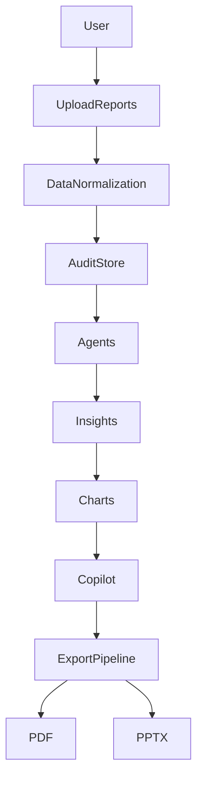

# Platform Architecture

Auto-generated architecture overview.

## High-Level Flow

## Layers

1. **Upload & normalization** — Reports parsed and stored in Audit Store.
2. **Agents** — SLM and Gemini agents produce metrics, insights, waste/scaling signals.
3. **Charts** — Rendered from PremiumState (Python or Node fallback).
4. **Copilot** — Query Intelligence routes to SLM or Gemini; responses validated.
5. **Export** — Zenith Export Orchestrator builds PremiumState → CXO Judge → PPTX/PDF.
