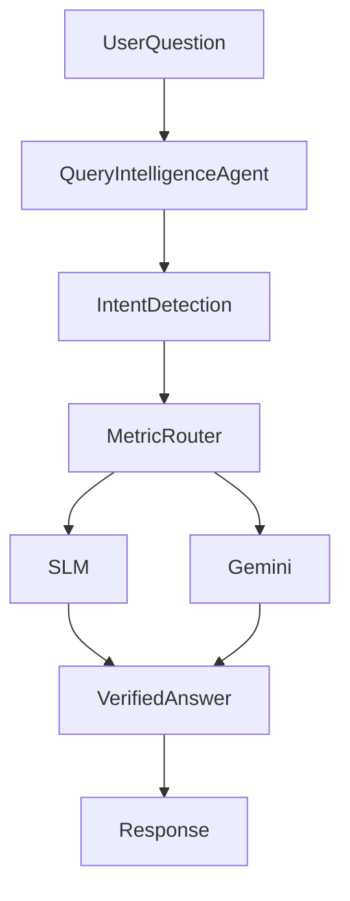

# AI Copilot

## Flow

## SLM vs Gemini

- **SLM (Small Language Model / deterministic):** Metric queries (spend, sales, ROAS, ACOS, etc.) answered from `storeSummary` without calling Gemini.
- **Gemini:** Explanations, diagnostics, strategy, and complex questions use the LLM with audit context.

## Context Builder

Audit context includes: metrics, tables, charts, insights, storeSummary, patterns, opportunities, agentSignals, verifiedInsights, chartSignals, conversationMemory.

## Conversation Memory

Turns are appended for follow-up context in the prompt.
