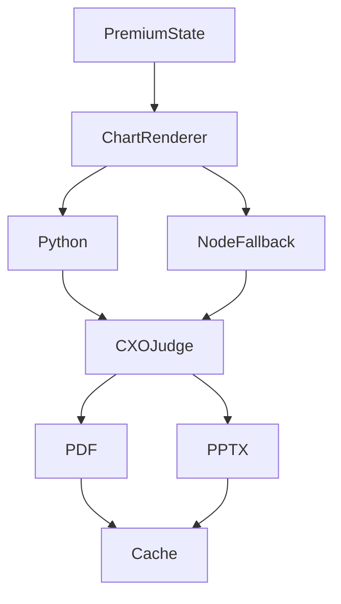

# Export System (Zenith)

## Flow

## PremiumState

Unified state: verifiedMetrics, verifiedInsights, charts, tables, campaignAnalysis, keywordAnalysis, wasteAnalysis, profitability, structuredInsights, brandAnalysis.

## CXO Judge

- **PASSED** / **PASSED_WITH_WARNINGS** — export proceeds (simplified layout on warnings).
- **FAILED_ACCURACY** / **FAILED_STORYLINE** — block export.
- Visual limits: max_table_rows=25, max_slide_words=180, max_points_scatter=600, max_categories_bar=40.

## Cache

- Local: `project/export-cache`
- Serverless (Vercel): `/tmp/export-cache`
