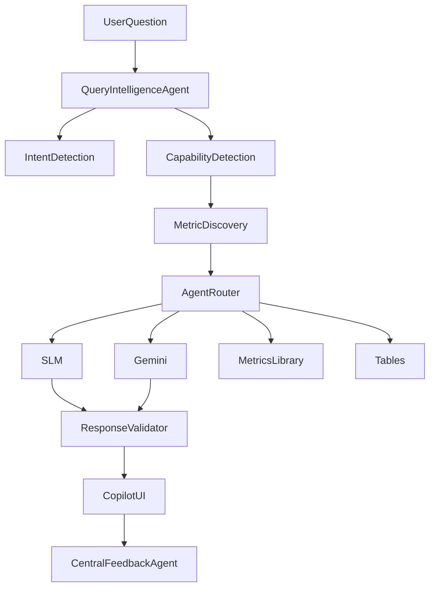

# Query Intelligence System

## Pipeline

## Intent Types

metric | formula | dataset | diagnostic | strategy | explanation | forecast | out_of_scope

## Capability

available | derivable | unknown | out_of_scope

## Agent Router

- **metric** → SLM calculation engine
- **formula** → metrics library (amazonMetricsLibrary)
- **dataset** → PremiumState tables
- **diagnostic / strategy** → Gemini
